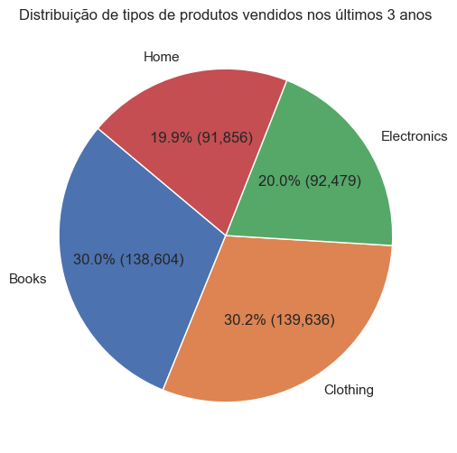
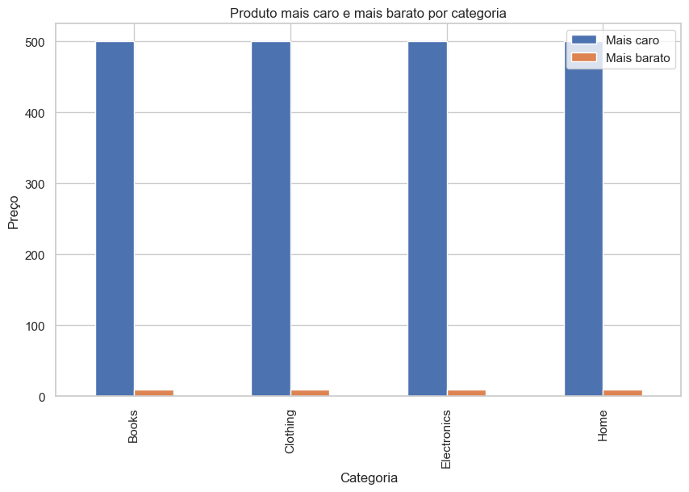
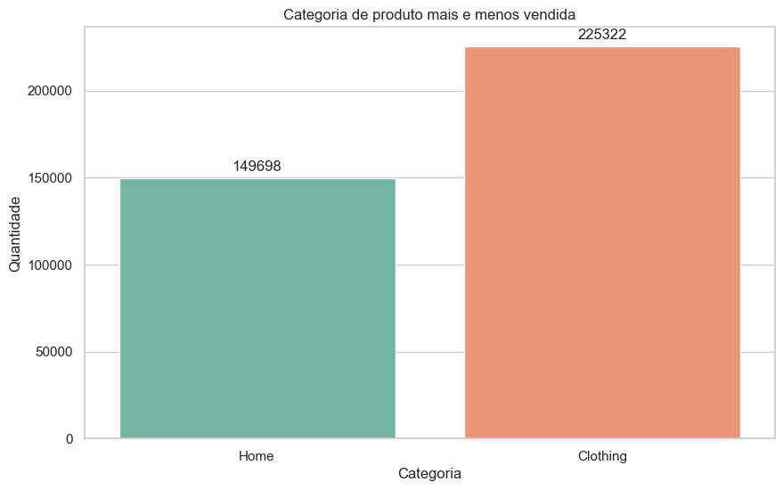
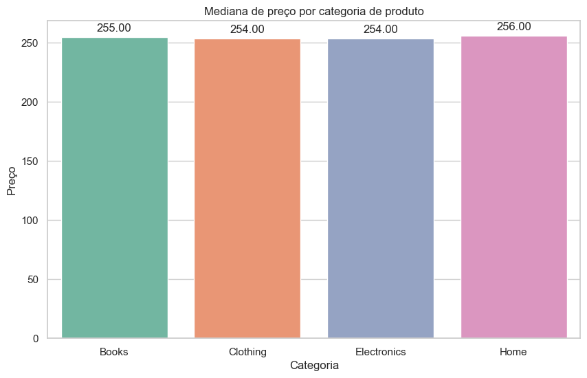
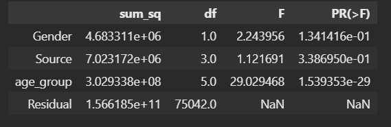
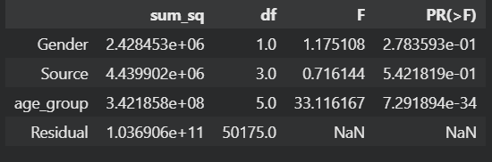
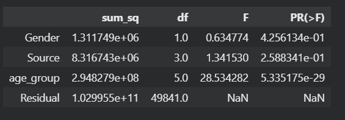
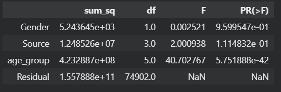

# Desafio de estágio em dados - Itaú Unibanco

## Desenvolvedor: Lucca Machado da Silva

## Perguntas iniciais :

### Quais os produtos mais vendidos considerando os últimos 3 anos ? 

A seguinte imagem exibe a distribuição de vendas nos últimos 3 anos, considerando a data de 30 de maio de 2021. É possível observar que os dois produtos que mais venderam foram livros e roupas, praticamente empatando em quantidade, seguido de eletronicos e produtos de casa, também com quantidades extremamente similares.

### Qual o produto mais caro e o mais barato ?

Não existe uma categoria com um produto mais caro ou mais barato em comparativo com as outras, em todas as categorias o mesmo padrão se repete, o produto mais barato tem o preço 10 e o mais caro o preço 500.

### Qual a categoria de produto mais vendida e a menos vendida? Qual a categoria mais cara e menos cara?

A categoria mais vendida foi a de roupas e a menos vendida foi a de produtos caseiros

Através da análise da mediana de preço de produtos por categoria é possível observar uma variação extremamente baixa, onde os produtos mais caros se encontram no setor de produtos para casa e os mais baratos em roupa e eletronicos, que possuem a mesma mediana.

# Resolução do Desafio

Para responder ao desafio "Analisando a base de dados, qual o tipo de público (considerando gênero e idade) e o canal ideal para vender determinado tipo de produto?", a principal tática adotada foi a análise exploratória dos dados em conjunto com a análise de variância (ANOVA).

Pensando no melhor tipo de solução possível, não se pode levar em consideração apenas os dados de gênero, idade, fonte e categoria de produto, pois o valor gasto também é um fator extremamente importante. Portanto, foram utilizadas as colunas 'Product Category', 'Customer Age', 'Gender', 'Source' e 'Total Purchase Amount' para responder ao desafio.

Somado a isso, foram propostas quatro hipóteses norteadoras para a resolução do desafio. São elas:

### Hipótese 1: Diferença no Total_Purchase_Amount entre os gêneros

- **Hipótese nula:** Não existe diferença significativa no Total_Purchase_Amount entre os gêneros.
- **Hipótese alternativa:** Existe diferença significativa no Total_Purchase_Amount entre os gêneros.

### Hipótese 2: Diferença no Total_Purchase_Amount entre as diferentes fontes

- **Hipótese nula:** Não existe diferença significativa no Total_Purchase_Amount entre as diferentes fontes.
- **Hipótese alternativa:** Existe diferença significativa no Total_Purchase_Amount entre as diferentes fontes.

### Hipótese 3: Diferença no Total_Purchase_Amount entre as diferentes faixas etárias

- **Hipótese nula:** Não existe diferença significativa no Total_Purchase_Amount entre as diferentes faixas etárias.
- **Hipótese alternativa:** Existe diferença significativa no Total_Purchase_Amount entre as diferentes faixas etárias.

### Hipótese 4: Grupo ideal para venda de um produto específico

- **Hipótese nula:** Não existe um grupo que forneça o melhor valor de venda possível em relação aos outros.
- **Hipótese alternativa:** Existe um grupo que forneça o maior valor de venda possível em relação aos outros.

**Abordagem Para a Quarta Hipótese:** Para testar esta hipótese, iremos agrupar os dados por faixa etária e origem, somar a quantidade total de compras pertencentes a cada grupo e extrair a mediana do valor total gasto por esse grupo.

## Roteiro de análise para todas as categorias

- Separar os tipos de produtos em conjunto de dados diferentes para análise individual.
- Utilização da tabela ANOVA (Análise de Variância) e dos p-values para aceitar as hipóteses nulas ou alternativas.
- Verificar os resultados da tabela ANOVA através dos dados de cada tipo de produto.
- Agrupar as vendas de cada tipo de produto por origem e grupo etário, extraindo a mediana de Total_Purchase_Amount gasto.
- Após o agrupamento realizar a multiplicação da mediana de Total_Purchase_Amount por Source_Count, ou seja, a obtenção do valor mediano gasto por aquele grupo (considerando grupo etário e origem).
- Utilização desta nova variável obtida como indicador da mediana do valor total gasto por um determinado grupo, obtendo assim os melhores grupos para vender uma categoria de produto.

## Análise das hipóteses 1, 2 e 3 para todas as categorias de produtos

A fim de determinar se a hipótese nula ou alternativa seria aceita para os quatro diferentes tipos de categorias de produtos foi utilzado a tabela ANOVA. 

    

        <h4>ANOVA para categoria clothing</h4>
        
    

    

        <h4>ANOVA para categoria eletronics</h4>
        
    

    

        <h4>ANOVA para categoria home</h4>
        
    

        

        <h4>ANOVA para catagoria books</h4>
        
    

 As tabelas acima exibem o grau de significancia de variacia entre a variável Total_Purchase_Amount e as variáveis de Genero, Source e age_group para os diferentes tipos de categoria de produto. Para que uma variável tenha um efeito significante em Total_Purchase_Amount é necessário que seu p-value seja menor que 0.05, e quanto menor esse valor, maior o seu efeito. Através disso, é possível observar uma tendência, de que o genero e o Source não tem efeitos significante em Total_Purchase_Amount para todas as categorias de produto, sendo assim, podemos assumir as hipóteses nulas sobre as hipóteses 1 e 2 para todas as categorias de produto, tendo em vista que seus p-values são altos. De maneira similar, é possível observar que para todas as categorias de produtos o age_group possui um p-value extremamente baixo, assim, indica-se que devemos aceitar a hipótese alternativa para todas as categorias de produtos, que indica que o grupo etário influência diretamente no valor gasto total em uma compra.

 As tabelas abaixo

 

    

        <h5>Mediana de Total_Purchase_Amount por genero  </h5>
        
    

    

        <h4>ANOVA para categoria eletronics</h4>
        
    

    

        <h4>ANOVA para categoria home</h4>
        
    

        

        <h4>ANOVA para catagoria books</h4>
        
    

