# Desafio de estágio em dados - Itaú Unibanco

## Desenvolvedor: Lucca Machado da Silva

## Perguntas iniciais :

### Quais os produtos mais vendidos considerando os últimos 3 anos ? 

A seguinte imagem exibe a distribuição de vendas nos últimos 3 anos, considerando a data de 30 de maio de 2021. É possível observar que os dois produtos que mais venderam foram livros e roupas, praticamente empatando em quantidade, seguido de eletronicos e produtos de casa, também com quantidades extremamente similares.

### Qual o produto mais caro e o mais barato ?

Não existe uma categoria com um produto mais caro ou mais barato em comparativo com as outras, em todas as categorias o mesmo padrão se repete, o produto mais barato tem o preço 10 e o mais caro o preço 500.

### Qual a categoria de produto mais vendida e a menos vendida? Qual a categoria mais cara e menos cara?

A categoria mais vendida foi a de roupas e a menos vendida foi a de produtos caseiros

Através da análise da mediana de preço de produtos por categoria é possível observar uma variação extremamente baixa, onde os produtos mais caros se encontram no setor de produtos para casa e os mais baratos em roupa e eletronicos, que possuem a mesma mediana.

# Resolução do Desafio

Para responder ao desafio "Analisando a base de dados, qual o tipo de público (considerando gênero e idade) e o canal ideal para vender determinado tipo de produto?", a principal tática adotada foi a análise exploratória dos dados em conjunto com a análise de variância (ANOVA).

Pensando no melhor tipo de solução possível, não se pode levar em consideração apenas os dados de gênero, idade, fonte e categoria de produto, pois o valor gasto também é um fator extremamente importante. Portanto, foram utilizadas as colunas 'Product Category', 'Customer Age', 'Gender', 'Source' e 'Total Purchase Amount' para responder ao desafio.

Somado a isso, foram propostas quatro hipóteses norteadoras para a resolução do desafio. São elas:

### Hipótese 1: Diferença no Total_Purchase_Amount entre os gêneros

- **Hipótese nula:** Não existe diferença significativa no Total_Purchase_Amount entre os gêneros.
- **Hipótese alternativa:** Existe diferença significativa no Total_Purchase_Amount entre os gêneros.

### Hipótese 2: Diferença no Total_Purchase_Amount entre as diferentes fontes

- **Hipótese nula:** Não existe diferença significativa no Total_Purchase_Amount entre as diferentes fontes.
- **Hipótese alternativa:** Existe diferença significativa no Total_Purchase_Amount entre as diferentes fontes.

### Hipótese 3: Diferença no Total_Purchase_Amount entre as diferentes faixas etárias

- **Hipótese nula:** Não existe diferença significativa no Total_Purchase_Amount entre as diferentes faixas etárias.
- **Hipótese alternativa:** Existe diferença significativa no Total_Purchase_Amount entre as diferentes faixas etárias.

### Hipótese 4: Grupo ideal para venda de um produto específico

- **Hipótese nula:** Não existe um grupo que forneça o melhor valor de venda possível em relação aos outros.
- **Hipótese alternativa:** Existe um grupo que forneça o maior valor de venda possível em relação aos outros.

**Abordagem Para a Quarta Hipótese:** Para testar esta hipótese, iremos agrupar os dados por faixa etária e origem, somar a quantidade total de compras pertencentes a cada grupo e extrair a mediana do valor total gasto por esse grupo.

## Roteiro de análise para todas as categorias

- Separar os tipos de produtos em conjunto de dados diferentes para análise individual.
- Utilização da tabela ANOVA (Análise de Variância) e dos p-values para aceitar as hipóteses nulas ou alternativas.
- Verificar os resultados da tabela ANOVA através dos dados de cada tipo de produto.
- Agrupar as vendas de cada tipo de produto por origem e grupo etário, extraindo a mediana de Total_Purchase_Amount gasto.
- Após o agrupamento realizar a multiplicação da mediana de Total_Purchase_Amount por Source_Count, ou seja, a obtenção do valor mediano gasto por aquele grupo (considerando grupo etário e origem).
- Utilização desta nova variável obtida como indicador da mediana do valor total gasto por um determinado grupo, obtendo assim os melhores grupos para vender uma categoria de produto.

## Análise para livros

A tabela ANOVA abaixo apresenta a análise de variância das variáveis Gênero, Origem e Grupo Etário em relação ao Total_Purchase_Amount. Podemos perceber que os p-values para Gender e Source são altos, 0.959 e 0.11 respectivamente, indicando que essas variáveis não têm um efeito significativo na variável Total_Purchase_Amount. Idealmente, o p-value precisa ser menor que 0.05 para indicar algum efeito significante. Tendo isso em vista, ambas as hipóteses nulas das hipóteses 1 e 2 são aceitas. Contudo, observando a linha de age_group, podemos notar um valor de p muito baixo, o que indica que a faixa etária afeta muito significativamente o Total_Purchase_Amount, sendo assim, aceita-se a hipótese alternativa da hipótese 3.

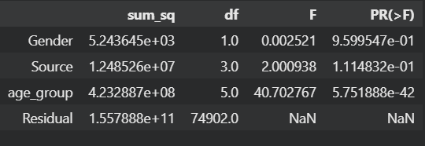

Para a confirmação do resultado obtido para as três primeiras hipóteses, é possível observar os dados das três tabelas abaixo.

#### Mediana do Total_Purchase_Amount por Gênero

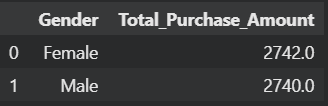

#### Mediana do Total_Purchase_Amount por Source

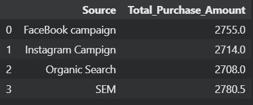

#### Mediana do Total_Purchase_Amount por Grupo Etário

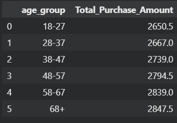

### Através da observação das 3 tabelas é possível confirmar que a análise de variância estava correta e que somente os grupos etários demonstram uma grande variância em relação ao Total_Purchase_Amount.

A tabela abaixo realiza a análise de variância de origens e grupos etários considerando a variável "Rate", que é obtida através da multiplicação da mediana de Total_Purchase_Amount pela quantidade de compras considerando aquela origem e grupo etário.

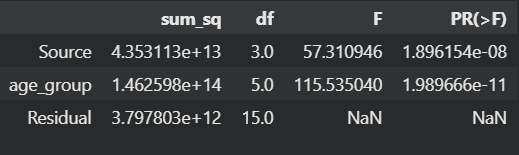

Através dessa tabela é possível observar que a origem e grupo etário possuem uma grande relação com a variância do Rate, devido aos seus p-values muito menores que 0.05, indicando que a hipótese alternativa deve ser aceita. Ou seja, existe de fato algum grupo dentre os possíveis que se destacam com a maior venda mediana.

A tabela abaixo exibe quais são os melhores grupos para a venda de livros, neste caso, o valor de Rate foi normalizado através da técnica de MinMax onde o valor máximo é transformado em 1 e o mínimo em 0.

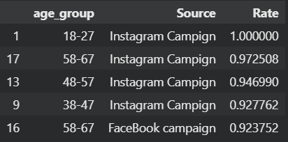

O gráfico abaixo exibe o "Rate" (indicador de melhor grupo para venda). 
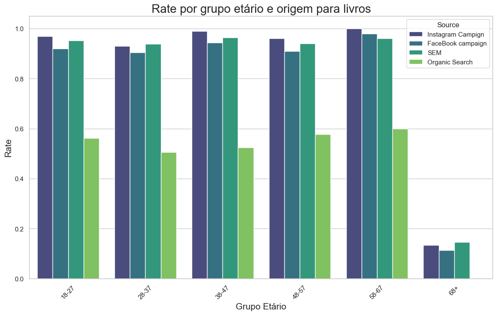

## Análise para eletronicos

A tabela anova para os produtos de categoria eletronicos indica que o gênero e a origem tem pouca significância, assim aceita-se as hipóteses nulas das hipotéses 1 e 2. Além disso, indica-se a alta significancia do grupo etário devido ao p-value muito baixo.

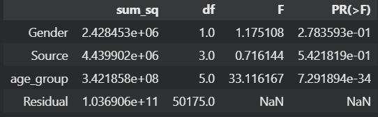

Para a confirmação do resultado obtido para as três primeiras hipóteses, é possível observar os dados das três tabelas abaixo.

#### Mediana do Total_Purchase_Amount por Gênero

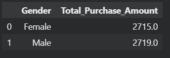

#### Mediana do Total_Purchase_Amount por Source

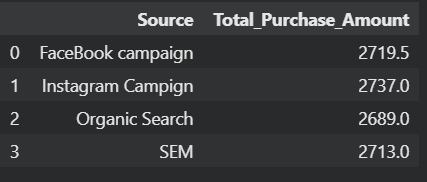

#### Mediana do Total_Purchase_Amount por Grupo Etário

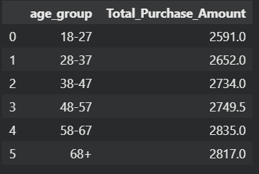

### Através da análise das 3 tabelas confirma-se o inferido com a análise da tabela de variância.

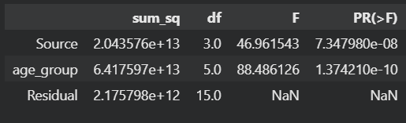

Através dessa tabela é possível observar que a origem e grupo etário possuem uma grande relação com a variância do Rate, devido aos seus p-values muito menores que 0.05, indicando que a hipótese alternativa deve ser aceita. Ou seja, existe de fato algum grupo dentre os possíveis que se destacam com a maior venda mediana.

A tabela abaixo exibe quais são os melhores grupos para a venda de livros, neste caso, o valor de Rate foi normalizado através da técnica de MinMax onde o valor máximo é transformado em 1 e o mínimo em 0.

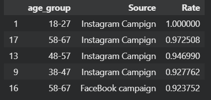

O gráfico abaixo exibe o "Rate" (indicador de melhor grupo para venda). 
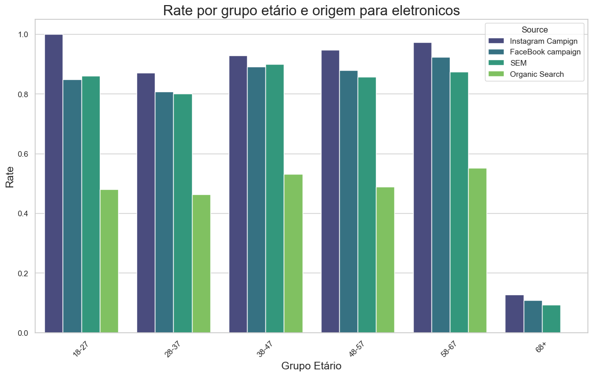

